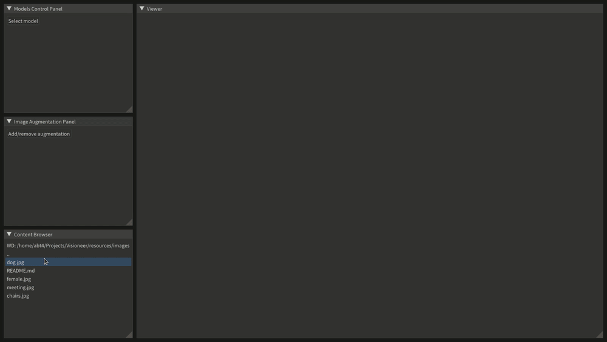

# Visioneer
This application allows you to evaluate the predictions of computer vision models under various conditions.

## How it works
1. Drag and drop image from Content Browser Panel.


2. Select model, enable it, tune parameters and assess predictions.


3. Add some augmentations and assess predictions again.


## Prerequisites
- C++17 (I use gcc 9.3.0).
- CMake 3.16 or newer is required. Can be installed with apt or build from source.
- [Git LFS](https://git-lfs.github.com/) is required to download ONNX models.
- OpenCV 4.5.3 or newer is required. If you have no OpenCV follow instructions, which are in the next section.
- ONNX Runtime installed from pre-build binaries available [here](https://github.com/microsoft/onnxruntime/releases/). Instructions are in the next section.
- spdlog, GLFW and ImGui installed via Git Submodules and do not require any configuration.

## Installation
```bash
# Setup OpenCV
wget -q -O opencv.zip https://github.com/opencv/opencv/archive/refs/tags/4.5.3.zip
unzip -q opencv.zip && rm opencv.zip
cd opencv-4.5.3
mkdir build && cd build
cmake .. -DBUILD_LIST=dnn,imgcodecs -DBUILD_opencv_apps=OFF -DCMAKE_INSTALL_PREFIX=/opt/opencv-4.5.3
sudo cmake --build . --target install -- -j$(nproc)
cd ../..

git clone --recursive https://github.com/teplandr/Visioneer.git
cd Visioneer

# Setup ONNX Runtime
wget -q https://github.com/microsoft/onnxruntime/releases/download/v1.9.0/onnxruntime-linux-x64-1.9.0.tgz
tar xvzf onnxruntime-linux-x64-1.9.0.tgz && rm onnxruntime-linux-x64-1.9.0.tgz
mv onnxruntime-linux-x64-1.9.0 3rdparty/onnxruntime

mkdir build && cd build
cmake ..
cmake --build . -- -j$(nproc)

# Setup ImGui widgets
cp ../resources/internal/imgui.ini .

# Run app
./Visioneer
```

## Dependencies
- [spdlog](https://github.com/gabime/spdlog)
- [glad](https://github.com/Dav1dde/glad)
- [GLFW](https://github.com/glfw/glfw)
- [ImGui](https://github.com/ocornut/imgui)
- [ONNX Runtime](https://github.com/microsoft/onnxruntime)
- [OpenCV](https://github.com/opencv/opencv)

## Acknowledgements
- [Yan Chernikov](https://github.com/TheCherno) and his [Game Engine](https://github.com/TheCherno/Hazel)
